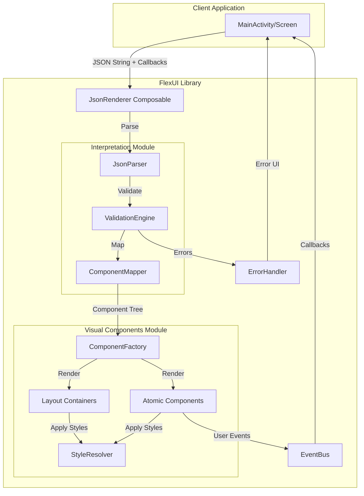

# Design Document

## Overview

La librería **FlexUI JSON Renderer** es un sistema modular para Android que permite renderizar interfaces de usuario de Jetpack Compose dinámicamente desde archivos JSON. El diseño sigue una arquitectura de dos capas principales: el módulo de interpretación (parsing y mapeo) y el módulo de componentes visuales (rendering). Esta separación permite mantener el código desacoplado, testeable y extensible.

### Objetivos del Diseño

- Proporcionar una API simple y declarativa para renderizar UIs desde JSON
- Mantener alto rendimiento mediante optimizaciones de Compose (remember, keys, lazy loading)
- Soportar composición jerárquica de componentes con anidamiento ilimitado
- Facilitar la extensión con nuevos tipos de componentes
- Manejar errores de forma robusta sin crashes en producción

### Alcance del MVP

El MVP incluye:
- 8 layout containers (contentVertical, contentHorizontal, contentScroll, contentWithFloatingButton, contentList, contentSlider)
- 10 componentes atómicos (componentInput, componentTextView, componentCheck, componentSelect, componentSliderCheck, componentButton, componentImage, componentLoader, componentToast)
- Sistema de callbacks para eventos de interacción
- Manejo de errores con placeholders visuales
- Parsing asíncrono de JSON

## Architecture

### High-Level Architecture




### Module Structure


```
FlexUI/
├── src/main/java/com/libs/flex/ui/flexui/
│   ├── JsonRenderer.kt                    # API pública principal
│   │
│   ├── parser/                            # Interpretation Module
│   │   ├── JsonParser.kt                  # Parseo de JSON a objetos
│   │   ├── ComponentMapper.kt             # Mapeo de tipos a descriptores
│   │   ├── ValidationEngine.kt            # Validación de estructura
│   │   └── exceptions/
│   │       ├── ComponentTypeNotFoundException.kt
│   │       ├── MissingPropertyException.kt
│   │       └── JsonParseException.kt
│   │
│   ├── model/                             # Data Models
│   │   ├── ComponentDescriptor.kt         # Clase base abstracta
│   │   ├── LayoutDescriptor.kt            # Para containers
│   │   ├── AtomicDescriptor.kt            # Para componentes atómicos
│   │   ├── ComponentType.kt               # Enum de tipos
│   │   ├── StyleProperties.kt             # Propiedades de estilo
│   │   └── EventData.kt                   # Datos de eventos
│   │
│   ├── components/                        # Visual Components Module
│   │   ├── ComponentFactory.kt            # Factory pattern
│   │   ├── containers/
│   │   │   ├── VerticalContainer.kt
│   │   │   ├── HorizontalContainer.kt
│   │   │   ├── ScrollContainer.kt
│   │   │   ├── FloatingButtonContainer.kt
│   │   │   ├── ListContainer.kt
│   │   │   └── SliderContainer.kt
│   │   ├── atomic/
│   │   │   ├── InputComponent.kt
│   │   │   ├── TextViewComponent.kt
│   │   │   ├── CheckComponent.kt
│   │   │   ├── SelectComponent.kt
│   │   │   ├── SliderCheckComponent.kt
│   │   │   ├── ButtonComponent.kt
│   │   │   ├── ImageComponent.kt
│   │   │   ├── LoaderComponent.kt
│   │   │   └── ToastComponent.kt
│   │   └── ErrorPlaceholder.kt
│   │
│   ├── styling/
│   │   ├── StyleResolver.kt               # Resuelve estilos desde JSON
│   │   ├── ColorParser.kt                 # Parsea colores hex
│   │   ├── DimensionParser.kt             # Parsea dimensiones
│   │   └── ThemeProvider.kt               # Tema por defecto
│   │
│   ├── events/
│   │   ├── EventBus.kt                    # Manejo de eventos
│   │   ├── ComponentEvent.kt              # Sealed class de eventos
│   │   └── EventCallback.kt               # Interface de callback
│   │
│   └── utils/
│       ├── ErrorHandler.kt                # Manejo centralizado de errores
│       ├── ComponentCache.kt              # Cache de componentes parseados
│       └── Logger.kt                      # Logging interno
```

### Layer Responsibilities

**Interpretation Module (parser/)**
- Parsear JSON a objetos Kotlin usando kotlinx.serialization
- Validar estructura y propiedades requeridas
- Mapear tipos de string a enums ComponentType
- Construir árbol de ComponentDescriptor
- Lanzar excepciones descriptivas en caso de error

**Visual Components Module (components/)**
- Renderizar componentes Compose basados en descriptores
- Aplicar estilos y propiedades visuales
- Manejar estado interno de componentes interactivos
- Emitir eventos de interacción al EventBus
- Renderizar placeholders de error cuando falla un componente

**Event System (events/)**
- Propagar eventos de usuario a la aplicación cliente
- Mantener referencia a callbacks registrados
- Ejecutar callbacks en el hilo principal

## Components and Interfaces

### Core API


```kotlin
// JsonRenderer.kt - API pública principal
@Composable
fun JsonRenderer(
    jsonString: String,
    onEvent: (ComponentEvent) -> Unit = {},
    modifier: Modifier = Modifier,
    errorContent: @Composable (Throwable) -> Unit = { DefaultErrorContent(it) }
) {
    // Implementación que orquesta parsing y rendering
}

// Uso desde la aplicación cliente
@Composable
fun MyScreen() {
    val jsonConfig = remember { loadJsonFromAssets() }
    
    JsonRenderer(
        jsonString = jsonConfig,
        onEvent = { event ->
            when (event) {
                is ComponentEvent.Click -> handleClick(event.componentId)
                is ComponentEvent.ValueChange -> handleValueChange(event.componentId, event.value)
                is ComponentEvent.Selection -> handleSelection(event.componentId, event.selectedValue)
            }
        }
    )
}
```

### Data Models


```kotlin
// ComponentDescriptor.kt - Modelo base
@Serializable
sealed class ComponentDescriptor {
    abstract val id: String
    abstract val type: ComponentType
    abstract val style: StyleProperties?
}

@Serializable
data class LayoutDescriptor(
    override val id: String,
    override val type: ComponentType,
    override val style: StyleProperties? = null,
    val children: List<ComponentDescriptor> = emptyList(),
    val arrangement: String? = null,
    val alignment: String? = null,
    val scrollDirection: String? = null,
    val fabIcon: String? = null,
    val fabPosition: String? = null,
    val items: List<JsonElement>? = null,
    val itemTemplate: ComponentDescriptor? = null,
    val autoPlay: Boolean? = null,
    val autoPlayInterval: Long? = null
) : ComponentDescriptor()

@Serializable
data class AtomicDescriptor(
    override val id: String,
    override val type: ComponentType,
    override val style: StyleProperties? = null,
    val text: String? = null,
    val placeholder: String? = null,
    val value: JsonElement? = null,
    val inputStyle: String? = null,
    val textStyle: String? = null,
    val fontSize: Int? = null,
    val color: String? = null,
    val maxLines: Int? = null,
    val label: String? = null,
    val enabled: Boolean? = true,
    val checked: Boolean? = null,
    val options: List<SelectOption>? = null,
    val min: Float? = null,
    val max: Float? = null,
    val buttonStyle: String? = null,
    val imageUrl: String? = null,
    val contentScale: String? = null,
    val loaderStyle: String? = null,
    val size: Int? = null,
    val actionId: String? = null,
    val validation: ValidationRules? = null
) : ComponentDescriptor()

@Serializable
data class StyleProperties(
    val padding: PaddingValues? = null,
    val margin: PaddingValues? = null,
    val backgroundColor: String? = null,
    val borderRadius: Int? = null,
    val elevation: Int? = null,
    val width: String? = null,
    val height: String? = null
)

@Serializable
data class PaddingValues(
    val start: Int = 0,
    val top: Int = 0,
    val end: Int = 0,
    val bottom: Int = 0
)

@Serializable
data class SelectOption(
    val label: String,
    val value: String
)

@Serializable
data class ValidationRules(
    val required: Boolean = false,
    val minLength: Int? = null,
    val maxLength: Int? = null,
    val pattern: String? = null,
    val errorMessage: String? = null
)

enum class ComponentType {
    CONTENT_VERTICAL,
    CONTENT_HORIZONTAL,
    CONTENT_SCROLL,
    CONTENT_WITH_FLOATING_BUTTON,
    CONTENT_LIST,
    CONTENT_SLIDER,
    COMPONENT_INPUT,
    COMPONENT_TEXT_VIEW,
    COMPONENT_CHECK,
    COMPONENT_SELECT,
    COMPONENT_SLIDER_CHECK,
    COMPONENT_BUTTON,
    COMPONENT_IMAGE,
    COMPONENT_LOADER,
    COMPONENT_TOAST
}

// EventData.kt - Eventos
sealed class ComponentEvent {
    abstract val componentId: String
    abstract val timestamp: Long
    
    data class Click(
        override val componentId: String,
        override val timestamp: Long = System.currentTimeMillis(),
        val actionId: String? = null
    ) : ComponentEvent()
    
    data class ValueChange(
        override val componentId: String,
        override val timestamp: Long = System.currentTimeMillis(),
        val value: Any?
    ) : ComponentEvent()
    
    data class Selection(
        override val componentId: String,
        override val timestamp: Long = System.currentTimeMillis(),
        val selectedValue: String
    ) : ComponentEvent()
}
```

### Parser Components


```kotlin
// JsonParser.kt
class JsonParser {
    private val json = Json {
        ignoreUnknownKeys = true
        isLenient = true
        coerceInputValues = true
    }
    
    suspend fun parse(jsonString: String): Result<ComponentDescriptor> = withContext(Dispatchers.IO) {
        try {
            val jsonElement = json.parseToJsonElement(jsonString)
            val descriptor = parseComponent(jsonElement.jsonObject)
            Result.success(descriptor)
        } catch (e: Exception) {
            Result.failure(JsonParseException("Failed to parse JSON", e))
        }
    }
    
    private fun parseComponent(jsonObject: JsonObject): ComponentDescriptor {
        val type = jsonObject["type"]?.jsonPrimitive?.content
            ?: throw MissingPropertyException("type", "unknown")
        
        val componentType = ComponentMapper.mapType(type)
        
        return when {
            ComponentMapper.isLayoutType(componentType) -> parseLayout(jsonObject, componentType)
            else -> parseAtomic(jsonObject, componentType)
        }
    }
    
    private fun parseLayout(jsonObject: JsonObject, type: ComponentType): LayoutDescriptor {
        // Implementación de parseo de layouts
    }
    
    private fun parseAtomic(jsonObject: JsonObject, type: ComponentType): AtomicDescriptor {
        // Implementación de parseo de componentes atómicos
    }
}

// ComponentMapper.kt
object ComponentMapper {
    private val typeMap = mapOf(
        "contentVertical" to ComponentType.CONTENT_VERTICAL,
        "contentHorizontal" to ComponentType.CONTENT_HORIZONTAL,
        "contentScroll" to ComponentType.CONTENT_SCROLL,
        "contentWithFloatingButton" to ComponentType.CONTENT_WITH_FLOATING_BUTTON,
        "contentList" to ComponentType.CONTENT_LIST,
        "contentSlider" to ComponentType.CONTENT_SLIDER,
        "componentInput" to ComponentType.COMPONENT_INPUT,
        "componentTextView" to ComponentType.COMPONENT_TEXT_VIEW,
        "componentCheck" to ComponentType.COMPONENT_CHECK,
        "componentSelect" to ComponentType.COMPONENT_SELECT,
        "componentSliderCheck" to ComponentType.COMPONENT_SLIDER_CHECK,
        "componentButton" to ComponentType.COMPONENT_BUTTON,
        "componentImage" to ComponentType.COMPONENT_IMAGE,
        "componentLoader" to ComponentType.COMPONENT_LOADER,
        "componentToast" to ComponentType.COMPONENT_TOAST
    )
    
    fun mapType(typeString: String): ComponentType {
        return typeMap[typeString] 
            ?: throw ComponentTypeNotFoundException(typeString)
    }
    
    fun isLayoutType(type: ComponentType): Boolean {
        return type in listOf(
            ComponentType.CONTENT_VERTICAL,
            ComponentType.CONTENT_HORIZONTAL,
            ComponentType.CONTENT_SCROLL,
            ComponentType.CONTENT_WITH_FLOATING_BUTTON,
            ComponentType.CONTENT_LIST,
            ComponentType.CONTENT_SLIDER
        )
    }
}

// ValidationEngine.kt
class ValidationEngine {
    fun validate(descriptor: ComponentDescriptor): ValidationResult {
        val errors = mutableListOf<String>()
        
        // Validar propiedades requeridas según tipo
        when (descriptor) {
            is LayoutDescriptor -> validateLayout(descriptor, errors)
            is AtomicDescriptor -> validateAtomic(descriptor, errors)
        }
        
        return if (errors.isEmpty()) {
            ValidationResult.Success
        } else {
            ValidationResult.Failure(errors)
        }
    }
    
    private fun validateLayout(descriptor: LayoutDescriptor, errors: MutableList<String>) {
        if (descriptor.type == ComponentType.CONTENT_LIST && descriptor.items == null) {
            errors.add("contentList requires 'items' property")
        }
        // Más validaciones...
    }
    
    private fun validateAtomic(descriptor: AtomicDescriptor, errors: MutableList<String>) {
        if (descriptor.type == ComponentType.COMPONENT_TEXT_VIEW && descriptor.text == null) {
            errors.add("componentTextView requires 'text' property")
        }
        // Más validaciones...
    }
}

sealed class ValidationResult {
    object Success : ValidationResult()
    data class Failure(val errors: List<String>) : ValidationResult()
}
```

### Component Factory


```kotlin
// ComponentFactory.kt
object ComponentFactory {
    @Composable
    fun CreateComponent(
        descriptor: ComponentDescriptor,
        onEvent: (ComponentEvent) -> Unit,
        modifier: Modifier = Modifier
    ) {
        when (descriptor) {
            is LayoutDescriptor -> CreateLayout(descriptor, onEvent, modifier)
            is AtomicDescriptor -> CreateAtomic(descriptor, onEvent, modifier)
        }
    }
    
    @Composable
    private fun CreateLayout(
        descriptor: LayoutDescriptor,
        onEvent: (ComponentEvent) -> Unit,
        modifier: Modifier
    ) {
        val styledModifier = StyleResolver.applyStyles(modifier, descriptor.style)
        
        when (descriptor.type) {
            ComponentType.CONTENT_VERTICAL -> VerticalContainer(descriptor, onEvent, styledModifier)
            ComponentType.CONTENT_HORIZONTAL -> HorizontalContainer(descriptor, onEvent, styledModifier)
            ComponentType.CONTENT_SCROLL -> ScrollContainer(descriptor, onEvent, styledModifier)
            ComponentType.CONTENT_WITH_FLOATING_BUTTON -> FloatingButtonContainer(descriptor, onEvent, styledModifier)
            ComponentType.CONTENT_LIST -> ListContainer(descriptor, onEvent, styledModifier)
            ComponentType.CONTENT_SLIDER -> SliderContainer(descriptor, onEvent, styledModifier)
            else -> ErrorPlaceholder("Unknown layout type: ${descriptor.type}")
        }
    }
    
    @Composable
    private fun CreateAtomic(
        descriptor: AtomicDescriptor,
        onEvent: (ComponentEvent) -> Unit,
        modifier: Modifier
    ) {
        val styledModifier = StyleResolver.applyStyles(modifier, descriptor.style)
        
        when (descriptor.type) {
            ComponentType.COMPONENT_INPUT -> InputComponent(descriptor, onEvent, styledModifier)
            ComponentType.COMPONENT_TEXT_VIEW -> TextViewComponent(descriptor, styledModifier)
            ComponentType.COMPONENT_CHECK -> CheckComponent(descriptor, onEvent, styledModifier)
            ComponentType.COMPONENT_SELECT -> SelectComponent(descriptor, onEvent, styledModifier)
            ComponentType.COMPONENT_SLIDER_CHECK -> SliderCheckComponent(descriptor, onEvent, styledModifier)
            ComponentType.COMPONENT_BUTTON -> ButtonComponent(descriptor, onEvent, styledModifier)
            ComponentType.COMPONENT_IMAGE -> ImageComponent(descriptor, styledModifier)
            ComponentType.COMPONENT_LOADER -> LoaderComponent(descriptor, styledModifier)
            ComponentType.COMPONENT_TOAST -> ToastComponent(descriptor, styledModifier)
            else -> ErrorPlaceholder("Unknown component type: ${descriptor.type}")
        }
    }
}
```

### Example Component Implementations


```kotlin
// VerticalContainer.kt
@Composable
fun VerticalContainer(
    descriptor: LayoutDescriptor,
    onEvent: (ComponentEvent) -> Unit,
    modifier: Modifier = Modifier
) {
    val arrangement = when (descriptor.arrangement) {
        "top" -> Arrangement.Top
        "center" -> Arrangement.Center
        "bottom" -> Arrangement.Bottom
        "spaceBetween" -> Arrangement.SpaceBetween
        "spaceAround" -> Arrangement.SpaceAround
        "spaceEvenly" -> Arrangement.SpaceEvenly
        else -> Arrangement.Top
    }
    
    val alignment = when (descriptor.alignment) {
        "start" -> Alignment.Start
        "center" -> Alignment.CenterHorizontally
        "end" -> Alignment.End
        else -> Alignment.Start
    }
    
    Column(
        modifier = modifier,
        verticalArrangement = arrangement,
        horizontalAlignment = alignment
    ) {
        descriptor.children.forEach { child ->
            ComponentFactory.CreateComponent(
                descriptor = child,
                onEvent = onEvent
            )
        }
    }
}

// InputComponent.kt
@Composable
fun InputComponent(
    descriptor: AtomicDescriptor,
    onEvent: (ComponentEvent) -> Unit,
    modifier: Modifier = Modifier
) {
    var textState by remember { 
        mutableStateOf(descriptor.value?.jsonPrimitive?.content ?: "") 
    }
    
    val colors = when (descriptor.inputStyle) {
        "outlined" -> OutlinedTextFieldDefaults.colors()
        "filled" -> TextFieldDefaults.colors()
        else -> TextFieldDefaults.colors()
    }
    
    when (descriptor.inputStyle) {
        "outlined" -> OutlinedTextField(
            value = textState,
            onValueChange = { newValue ->
                textState = newValue
                onEvent(ComponentEvent.ValueChange(descriptor.id, newValue))
            },
            label = descriptor.label?.let { { Text(it) } },
            placeholder = descriptor.placeholder?.let { { Text(it) } },
            enabled = descriptor.enabled ?: true,
            modifier = modifier,
            colors = colors
        )
        else -> TextField(
            value = textState,
            onValueChange = { newValue ->
                textState = newValue
                onEvent(ComponentEvent.ValueChange(descriptor.id, newValue))
            },
            label = descriptor.label?.let { { Text(it) } },
            placeholder = descriptor.placeholder?.let { { Text(it) } },
            enabled = descriptor.enabled ?: true,
            modifier = modifier,
            colors = colors
        )
    }
}

// ButtonComponent.kt
@Composable
fun ButtonComponent(
    descriptor: AtomicDescriptor,
    onEvent: (ComponentEvent) -> Unit,
    modifier: Modifier = Modifier
) {
    when (descriptor.buttonStyle) {
        "primary" -> Button(
            onClick = {
                onEvent(ComponentEvent.Click(descriptor.id, actionId = descriptor.actionId))
            },
            modifier = modifier,
            enabled = descriptor.enabled ?: true
        ) {
            Text(descriptor.text ?: "Button")
        }
        "secondary" -> OutlinedButton(
            onClick = {
                onEvent(ComponentEvent.Click(descriptor.id, actionId = descriptor.actionId))
            },
            modifier = modifier,
            enabled = descriptor.enabled ?: true
        ) {
            Text(descriptor.text ?: "Button")
        }
        else -> Button(
            onClick = {
                onEvent(ComponentEvent.Click(descriptor.id, actionId = descriptor.actionId))
            },
            modifier = modifier,
            enabled = descriptor.enabled ?: true
        ) {
            Text(descriptor.text ?: "Button")
        }
    }
}

// ImageComponent.kt
@Composable
fun ImageComponent(
    descriptor: AtomicDescriptor,
    modifier: Modifier = Modifier
) {
    val contentScale = when (descriptor.contentScale) {
        "fit" -> ContentScale.Fit
        "crop" -> ContentScale.Crop
        "fillWidth" -> ContentScale.FillWidth
        "fillHeight" -> ContentScale.FillHeight
        else -> ContentScale.Fit
    }
    
    AsyncImage(
        model = descriptor.imageUrl,
        contentDescription = descriptor.text,
        modifier = modifier,
        contentScale = contentScale,
        placeholder = painterResource(R.drawable.placeholder_image),
        error = painterResource(R.drawable.error_image)
    )
}
```

### Style Resolver


```kotlin
// StyleResolver.kt
object StyleResolver {
    fun applyStyles(modifier: Modifier, style: StyleProperties?): Modifier {
        if (style == null) return modifier
        
        var result = modifier
        
        // Padding
        style.padding?.let { padding ->
            result = result.padding(
                start = padding.start.dp,
                top = padding.top.dp,
                end = padding.end.dp,
                bottom = padding.bottom.dp
            )
        }
        
        // Background color
        style.backgroundColor?.let { colorHex ->
            result = result.background(ColorParser.parse(colorHex))
        }
        
        // Size
        style.width?.let { width ->
            result = result.width(DimensionParser.parse(width))
        }
        style.height?.let { height ->
            result = result.height(DimensionParser.parse(height))
        }
        
        // Border radius
        style.borderRadius?.let { radius ->
            result = result.clip(RoundedCornerShape(radius.dp))
        }
        
        // Elevation
        style.elevation?.let { elevation ->
            result = result.shadow(elevation.dp, RoundedCornerShape(style.borderRadius?.dp ?: 0.dp))
        }
        
        return result
    }
}

// ColorParser.kt
object ColorParser {
    fun parse(colorHex: String): Color {
        return try {
            Color(android.graphics.Color.parseColor(colorHex))
        } catch (e: IllegalArgumentException) {
            Color.Transparent
        }
    }
}

// DimensionParser.kt
object DimensionParser {
    fun parse(dimension: String): Dp {
        return when {
            dimension.endsWith("dp") -> dimension.removeSuffix("dp").toIntOrNull()?.dp ?: 0.dp
            dimension == "match_parent" -> Dp.Infinity
            dimension == "wrap_content" -> Dp.Unspecified
            else -> dimension.toIntOrNull()?.dp ?: 0.dp
        }
    }
}
```

## Data Models

### JSON Schema Example


```json
{
  "id": "main_screen",
  "type": "contentScroll",
  "style": {
    "padding": {
      "start": 16,
      "top": 16,
      "end": 16,
      "bottom": 16
    }
  },
  "children": [
    {
      "id": "header",
      "type": "componentTextView",
      "text": "Welcome to FlexUI",
      "textStyle": "bold",
      "fontSize": 24,
      "color": "#000000",
      "style": {
        "padding": {
          "bottom": 16
        }
      }
    },
    {
      "id": "form_container",
      "type": "contentVertical",
      "arrangement": "top",
      "alignment": "start",
      "children": [
        {
          "id": "name_input",
          "type": "componentInput",
          "label": "Name",
          "placeholder": "Enter your name",
          "inputStyle": "outlined",
          "validation": {
            "required": true,
            "minLength": 2,
            "errorMessage": "Name must be at least 2 characters"
          }
        },
        {
          "id": "email_input",
          "type": "componentInput",
          "label": "Email",
          "placeholder": "Enter your email",
          "inputStyle": "outlined",
          "validation": {
            "required": true,
            "pattern": "^[\\w-\\.]+@([\\w-]+\\.)+[\\w-]{2,4}$",
            "errorMessage": "Invalid email format"
          }
        },
        {
          "id": "subscribe_check",
          "type": "componentCheck",
          "label": "Subscribe to newsletter",
          "checked": false
        },
        {
          "id": "country_select",
          "type": "componentSelect",
          "label": "Country",
          "placeholder": "Select your country",
          "options": [
            {"label": "United States", "value": "us"},
            {"label": "Canada", "value": "ca"},
            {"label": "Mexico", "value": "mx"}
          ]
        },
        {
          "id": "age_slider",
          "type": "componentSliderCheck",
          "label": "Age",
          "min": 18,
          "max": 100,
          "value": 25
        },
        {
          "id": "buttons_container",
          "type": "contentHorizontal",
          "arrangement": "spaceEvenly",
          "children": [
            {
              "id": "cancel_button",
              "type": "componentButton",
              "text": "Cancel",
              "buttonStyle": "secondary",
              "actionId": "cancel_action"
            },
            {
              "id": "submit_button",
              "type": "componentButton",
              "text": "Submit",
              "buttonStyle": "primary",
              "actionId": "submit_action"
            }
          ]
        }
      ]
    },
    {
      "id": "image_slider",
      "type": "contentSlider",
      "autoPlay": true,
      "autoPlayInterval": 3000,
      "items": [
        "https://example.com/image1.jpg",
        "https://example.com/image2.jpg",
        "https://example.com/image3.jpg"
      ]
    }
  ]
}
```

## Error Handling

### Error Hierarchy


```kotlin
// exceptions/FlexUIException.kt
sealed class FlexUIException(message: String, cause: Throwable? = null) : Exception(message, cause)

class JsonParseException(message: String, cause: Throwable? = null) : FlexUIException(message, cause)

class ComponentTypeNotFoundException(val type: String) : FlexUIException("Unknown component type: $type")

class MissingPropertyException(val property: String, val componentType: String) : 
    FlexUIException("Missing required property '$property' for component type '$componentType'")

class ValidationException(val errors: List<String>) : 
    FlexUIException("Validation failed: ${errors.joinToString(", ")}")

class RenderException(message: String, cause: Throwable? = null) : FlexUIException(message, cause)
```

### Error Handling Strategy

**Parsing Errors**
- Capturar excepciones de kotlinx.serialization
- Envolver en JsonParseException con mensaje descriptivo
- Retornar Result.failure() para manejo funcional
- Mostrar error UI con detalles del problema

**Validation Errors**
- Validar estructura antes de renderizar
- Acumular todos los errores de validación
- Lanzar ValidationException con lista completa
- Permitir al cliente decidir cómo manejar

**Rendering Errors**
- Usar try-catch en cada componente individual
- Renderizar ErrorPlaceholder en lugar del componente fallido
- Loggear error para debugging
- No propagar excepción para evitar crash de toda la UI

**Error Placeholder Component**


```kotlin
// ErrorPlaceholder.kt
@Composable
fun ErrorPlaceholder(
    message: String,
    modifier: Modifier = Modifier
) {
    Card(
        modifier = modifier
            .fillMaxWidth()
            .padding(8.dp),
        colors = CardDefaults.cardColors(
            containerColor = MaterialTheme.colorScheme.errorContainer
        )
    ) {
        Row(
            modifier = Modifier.padding(16.dp),
            verticalAlignment = Alignment.CenterVertically
        ) {
            Icon(
                imageVector = Icons.Default.Error,
                contentDescription = "Error",
                tint = MaterialTheme.colorScheme.error
            )
            Spacer(modifier = Modifier.width(8.dp))
            Text(
                text = message,
                style = MaterialTheme.typography.bodyMedium,
                color = MaterialTheme.colorScheme.onErrorContainer
            )
        }
    }
}

@Composable
fun DefaultErrorContent(error: Throwable) {
    Column(
        modifier = Modifier
            .fillMaxSize()
            .padding(16.dp),
        horizontalAlignment = Alignment.CenterHorizontally,
        verticalArrangement = Arrangement.Center
    ) {
        Icon(
            imageVector = Icons.Default.Error,
            contentDescription = "Error",
            modifier = Modifier.size(64.dp),
            tint = MaterialTheme.colorScheme.error
        )
        Spacer(modifier = Modifier.height(16.dp))
        Text(
            text = "Failed to render UI",
            style = MaterialTheme.typography.headlineSmall
        )
        Spacer(modifier = Modifier.height(8.dp))
        Text(
            text = error.message ?: "Unknown error",
            style = MaterialTheme.typography.bodyMedium,
            textAlign = TextAlign.Center
        )
    }
}
```

## Testing Strategy

### Unit Tests

**Parser Tests**
- Test parsing válido de cada tipo de componente
- Test manejo de JSON malformado
- Test validación de propiedades requeridas
- Test mapeo de tipos desconocidos
- Test parsing de estructuras anidadas complejas

**Component Tests**
- Test renderizado de cada componente con propiedades mínimas
- Test aplicación de estilos
- Test callbacks de eventos
- Test estados interactivos (checked, selected, value)
- Test manejo de propiedades opcionales

**Style Resolver Tests**
- Test parsing de colores hex válidos e inválidos
- Test parsing de dimensiones (dp, match_parent, wrap_content)
- Test aplicación de padding, margin, background
- Test combinación de múltiples estilos

### Integration Tests

**End-to-End Rendering**
- Test renderizado de JSON completo con múltiples niveles
- Test navegación en sliders y listas
- Test interacción con formularios completos
- Test propagación de eventos desde componentes anidados

**Performance Tests**
- Test parsing de JSON grande (>1000 componentes)
- Test renderizado de listas largas con LazyColumn
- Test recomposición eficiente con cambios de estado
- Test uso de memoria con imágenes múltiples

### UI Tests (Compose Testing)


```kotlin
// Example UI Test
@Test
fun testButtonClickTriggersEvent() {
    val json = """
        {
            "id": "test_button",
            "type": "componentButton",
            "text": "Click Me",
            "buttonStyle": "primary",
            "actionId": "test_action"
        }
    """.trimIndent()
    
    var eventReceived: ComponentEvent? = null
    
    composeTestRule.setContent {
        JsonRenderer(
            jsonString = json,
            onEvent = { event -> eventReceived = event }
        )
    }
    
    composeTestRule.onNodeWithText("Click Me").performClick()
    
    assertNotNull(eventReceived)
    assertTrue(eventReceived is ComponentEvent.Click)
    assertEquals("test_button", (eventReceived as ComponentEvent.Click).componentId)
    assertEquals("test_action", (eventReceived as ComponentEvent.Click).actionId)
}
```

## Performance Optimizations

### Parsing Optimization

**Background Threading**
- Ejecutar parsing en Dispatchers.IO
- Usar suspend functions para operaciones asíncronas
- Retornar Result para manejo funcional sin bloqueo

**Caching**


```kotlin
// ComponentCache.kt
class ComponentCache {
    private val cache = mutableMapOf<String, ComponentDescriptor>()
    
    fun get(jsonHash: String): ComponentDescriptor? = cache[jsonHash]
    
    fun put(jsonHash: String, descriptor: ComponentDescriptor) {
        cache[jsonHash] = descriptor
    }
    
    fun clear() {
        cache.clear()
    }
    
    private fun String.hash(): String {
        return MessageDigest.getInstance("MD5")
            .digest(toByteArray())
            .joinToString("") { "%02x".format(it) }
    }
}

// Uso en JsonRenderer
@Composable
fun JsonRenderer(
    jsonString: String,
    onEvent: (ComponentEvent) -> Unit = {},
    modifier: Modifier = Modifier,
    errorContent: @Composable (Throwable) -> Unit = { DefaultErrorContent(it) }
) {
    val cache = remember { ComponentCache() }
    val jsonHash = remember(jsonString) { jsonString.hashCode().toString() }
    
    var descriptor by remember { mutableStateOf<ComponentDescriptor?>(null) }
    var error by remember { mutableStateOf<Throwable?>(null) }
    var isLoading by remember { mutableStateOf(true) }
    
    LaunchedEffect(jsonString) {
        // Check cache first
        cache.get(jsonHash)?.let {
            descriptor = it
            isLoading = false
            return@LaunchedEffect
        }
        
        // Parse in background
        val parser = JsonParser()
        parser.parse(jsonString).fold(
            onSuccess = { parsed ->
                cache.put(jsonHash, parsed)
                descriptor = parsed
                isLoading = false
            },
            onFailure = { throwable ->
                error = throwable
                isLoading = false
            }
        )
    }
    
    when {
        isLoading -> LoaderComponent(
            AtomicDescriptor(
                id = "loading",
                type = ComponentType.COMPONENT_LOADER,
                loaderStyle = "circular"
            ),
            Modifier.fillMaxSize()
        )
        error != null -> errorContent(error!!)
        descriptor != null -> ComponentFactory.CreateComponent(
            descriptor = descriptor!!,
            onEvent = onEvent,
            modifier = modifier
        )
    }
}
```

### Compose Optimization

**Remember and Keys**


```kotlin
// ListContainer.kt - Optimized with keys
@Composable
fun ListContainer(
    descriptor: LayoutDescriptor,
    onEvent: (ComponentEvent) -> Unit,
    modifier: Modifier = Modifier
) {
    LazyColumn(modifier = modifier) {
        items(
            items = descriptor.items ?: emptyList(),
            key = { item -> 
                // Use stable key for efficient recomposition
                item.jsonObject["id"]?.jsonPrimitive?.content ?: item.hashCode()
            }
        ) { item ->
            descriptor.itemTemplate?.let { template ->
                // Create component from template with item data
                ComponentFactory.CreateComponent(
                    descriptor = mergeItemData(template, item),
                    onEvent = onEvent
                )
            }
            
            // Divider if specified
            if (descriptor.style?.borderRadius != null) {
                HorizontalDivider()
            }
        }
    }
}

// Use derivedStateOf for expensive computations
@Composable
fun SliderContainer(
    descriptor: LayoutDescriptor,
    onEvent: (ComponentEvent) -> Unit,
    modifier: Modifier = Modifier
) {
    val pagerState = rememberPagerState(pageCount = { descriptor.items?.size ?: 0 })
    
    // Auto-play logic
    val autoPlay = descriptor.autoPlay ?: false
    val interval = descriptor.autoPlayInterval ?: 3000L
    
    LaunchedEffect(autoPlay, pagerState.currentPage) {
        if (autoPlay) {
            delay(interval)
            val nextPage = (pagerState.currentPage + 1) % pagerState.pageCount
            pagerState.animateScrollToPage(nextPage)
        }
    }
    
    Column(modifier = modifier) {
        HorizontalPager(
            state = pagerState,
            modifier = Modifier.weight(1f)
        ) { page ->
            val imageUrl = descriptor.items?.get(page)?.jsonPrimitive?.content
            ImageComponent(
                descriptor = AtomicDescriptor(
                    id = "${descriptor.id}_image_$page",
                    type = ComponentType.COMPONENT_IMAGE,
                    imageUrl = imageUrl,
                    contentScale = "crop"
                ),
                modifier = Modifier.fillMaxSize()
            )
        }
        
        // Page indicators
        Row(
            modifier = Modifier
                .fillMaxWidth()
                .padding(8.dp),
            horizontalArrangement = Arrangement.Center
        ) {
            repeat(pagerState.pageCount) { index ->
                val color by animateColorAsState(
                    targetValue = if (pagerState.currentPage == index) 
                        MaterialTheme.colorScheme.primary 
                    else 
                        MaterialTheme.colorScheme.onSurface.copy(alpha = 0.3f),
                    label = "indicator_color"
                )
                Box(
                    modifier = Modifier
                        .padding(4.dp)
                        .size(8.dp)
                        .background(color, CircleShape)
                )
            }
        }
    }
}
```

### Image Loading Optimization


```kotlin
// Use Coil for efficient image loading
// ImageComponent.kt
@Composable
fun ImageComponent(
    descriptor: AtomicDescriptor,
    modifier: Modifier = Modifier
) {
    val contentScale = when (descriptor.contentScale) {
        "fit" -> ContentScale.Fit
        "crop" -> ContentScale.Crop
        "fillWidth" -> ContentScale.FillWidth
        "fillHeight" -> ContentScale.FillHeight
        else -> ContentScale.Fit
    }
    
    AsyncImage(
        model = ImageRequest.Builder(LocalContext.current)
            .data(descriptor.imageUrl)
            .crossfade(true)
            .memoryCachePolicy(CachePolicy.ENABLED)
            .diskCachePolicy(CachePolicy.ENABLED)
            .build(),
        contentDescription = descriptor.text,
        modifier = modifier,
        contentScale = contentScale,
        placeholder = painterResource(R.drawable.placeholder_image),
        error = painterResource(R.drawable.error_image)
    )
}
```

## Dependencies

### Required Libraries


```kotlin
// FlexUI/build.gradle.kts
dependencies {
    // Compose BOM
    implementation(platform("androidx.compose:compose-bom:2024.09.00"))
    implementation("androidx.compose.ui:ui")
    implementation("androidx.compose.ui:ui-graphics")
    implementation("androidx.compose.ui:ui-tooling-preview")
    implementation("androidx.compose.material3:material3")
    implementation("androidx.compose.foundation:foundation")
    
    // Compose Foundation - for HorizontalPager
    implementation("androidx.compose.foundation:foundation:1.7.0")
    
    // Kotlinx Serialization
    implementation("org.jetbrains.kotlinx:kotlinx-serialization-json:1.6.3")
    
    // Coil for image loading
    implementation("io.coil-kt:coil-compose:2.5.0")
    
    // Coroutines
    implementation("org.jetbrains.kotlinx:kotlinx-coroutines-android:1.8.0")
    
    // Core Android
    implementation("androidx.core:core-ktx:1.17.0")
    implementation("androidx.lifecycle:lifecycle-runtime-ktx:2.9.4")
    
    // Testing
    testImplementation("junit:junit:4.13.2")
    testImplementation("org.jetbrains.kotlinx:kotlinx-coroutines-test:1.8.0")
    testImplementation("io.mockk:mockk:1.13.9")
    
    androidTestImplementation("androidx.test.ext:junit:1.3.0")
    androidTestImplementation("androidx.test.espresso:espresso-core:3.7.0")
    androidTestImplementation("androidx.compose.ui:ui-test-junit4")
    
    debugImplementation("androidx.compose.ui:ui-tooling")
    debugImplementation("androidx.compose.ui:ui-test-manifest")
}
```

### Plugin Configuration


```kotlin
// FlexUI/build.gradle.kts
plugins {
    alias(libs.plugins.android.library)
    alias(libs.plugins.kotlin.android)
    alias(libs.plugins.kotlin.compose)
    kotlin("plugin.serialization") version "2.0.21"
}

android {
    namespace = "com.libs.flex.ui.flexui"
    compileSdk = 36

    defaultConfig {
        minSdk = 24
        testInstrumentationRunner = "androidx.test.runner.AndroidJUnitRunner"
        consumerProguardFiles("consumer-rules.pro")
    }

    buildFeatures {
        compose = true
    }

    composeOptions {
        kotlinCompilerExtensionVersion = "1.5.14"
    }

    buildTypes {
        release {
            isMinifyEnabled = false
            proguardFiles(
                getDefaultProguardFile("proguard-android-optimize.txt"),
                "proguard-rules.pro"
            )
        }
    }
    
    compileOptions {
        sourceCompatibility = JavaVersion.VERSION_11
        targetCompatibility = JavaVersion.VERSION_11
    }
    
    kotlinOptions {
        jvmTarget = "11"
    }
}
```

## Design Decisions and Rationale

### Why kotlinx.serialization over Gson/Moshi?

- Mejor integración con Kotlin multiplatform
- Soporte nativo para sealed classes y data classes
- Generación de código en tiempo de compilación (más rápido)
- Manejo robusto de tipos nullable y default values

### Why Sealed Classes for ComponentDescriptor?

- Type safety en tiempo de compilación
- Exhaustive when expressions
- Facilita pattern matching
- Previene errores de casting

### Why ComponentFactory Pattern?

- Centraliza la lógica de creación de componentes
- Facilita testing con mocks
- Permite extensión sin modificar código existente
- Maneja errores de forma consistente

### Why Separate Layout and Atomic Descriptors?

- Claridad en la jerarquía de componentes
- Diferentes propiedades para containers vs componentes finales
- Facilita validación específica por tipo
- Mejora la legibilidad del código

### Why EventBus Pattern for Callbacks?

- Desacopla componentes de la lógica de negocio
- Permite múltiples listeners si es necesario
- Facilita testing de interacciones
- Mantiene componentes puros y reutilizables

## Security Considerations

### Input Validation

- Validar todos los inputs del JSON antes de usar
- Sanitizar URLs de imágenes para prevenir inyección
- Limitar tamaño máximo de JSON (ej: 5MB)
- Validar rangos numéricos (min/max para sliders)

### Network Security

- Usar HTTPS para cargar imágenes remotas
- Implementar certificate pinning si es necesario
- Timeout para requests de imágenes
- Manejo de errores de red sin exponer detalles internos

### Data Privacy

- No loggear datos sensibles del JSON
- Permitir al cliente controlar qué se loggea
- No persistir JSON en cache sin encriptación
- Respetar configuraciones de privacidad del sistema

## Accessibility

### Compose Semantics


```kotlin
// Todos los componentes deben incluir semantics apropiados
@Composable
fun ButtonComponent(
    descriptor: AtomicDescriptor,
    onEvent: (ComponentEvent) -> Unit,
    modifier: Modifier = Modifier
) {
    Button(
        onClick = {
            onEvent(ComponentEvent.Click(descriptor.id, actionId = descriptor.actionId))
        },
        modifier = modifier.semantics {
            contentDescription = descriptor.text ?: "Button"
            role = Role.Button
        },
        enabled = descriptor.enabled ?: true
    ) {
        Text(descriptor.text ?: "Button")
    }
}

// Soporte para content descriptions desde JSON
@Serializable
data class AtomicDescriptor(
    // ... existing properties
    val contentDescription: String? = null,
    val semanticRole: String? = null
)
```

### Minimum Touch Target Sizes

- Todos los componentes interactivos deben tener mínimo 48dp x 48dp
- Aplicar padding si el componente es más pequeño
- Validar en tests de UI

### Color Contrast

- Validar contraste de colores desde JSON
- Proporcionar tema por defecto accesible
- Advertir si el contraste es insuficiente (WCAG AA: 4.5:1)

## Extensibility

### Adding New Component Types


```kotlin
// Para agregar un nuevo componente:

// 1. Agregar tipo al enum
enum class ComponentType {
    // ... existing types
    COMPONENT_RATING_BAR  // nuevo
}

// 2. Agregar mapeo en ComponentMapper
object ComponentMapper {
    private val typeMap = mapOf(
        // ... existing mappings
        "componentRatingBar" to ComponentType.COMPONENT_RATING_BAR
    )
}

// 3. Extender AtomicDescriptor con propiedades necesarias
@Serializable
data class AtomicDescriptor(
    // ... existing properties
    val rating: Float? = null,
    val maxRating: Int? = null
)

// 4. Crear el componente Compose
@Composable
fun RatingBarComponent(
    descriptor: AtomicDescriptor,
    onEvent: (ComponentEvent) -> Unit,
    modifier: Modifier = Modifier
) {
    var rating by remember { mutableStateOf(descriptor.rating ?: 0f) }
    
    // Implementación del rating bar
    Row(modifier = modifier) {
        repeat(descriptor.maxRating ?: 5) { index ->
            Icon(
                imageVector = if (index < rating) Icons.Filled.Star else Icons.Outlined.Star,
                contentDescription = "Star ${index + 1}",
                modifier = Modifier
                    .clickable {
                        rating = (index + 1).toFloat()
                        onEvent(ComponentEvent.ValueChange(descriptor.id, rating))
                    }
                    .size(32.dp),
                tint = MaterialTheme.colorScheme.primary
            )
        }
    }
}

// 5. Agregar al ComponentFactory
@Composable
private fun CreateAtomic(
    descriptor: AtomicDescriptor,
    onEvent: (ComponentEvent) -> Unit,
    modifier: Modifier
) {
    when (descriptor.type) {
        // ... existing cases
        ComponentType.COMPONENT_RATING_BAR -> RatingBarComponent(descriptor, onEvent, modifier)
        else -> ErrorPlaceholder("Unknown component type: ${descriptor.type}")
    }
}
```

### Custom Styling


```kotlin
// Permitir al cliente proporcionar tema personalizado
@Composable
fun JsonRenderer(
    jsonString: String,
    onEvent: (ComponentEvent) -> Unit = {},
    modifier: Modifier = Modifier,
    theme: @Composable (content: @Composable () -> Unit) -> Unit = { MaterialTheme { it() } },
    errorContent: @Composable (Throwable) -> Unit = { DefaultErrorContent(it) }
) {
    theme {
        // Rendering logic
    }
}

// Uso con tema personalizado
@Composable
fun MyScreen() {
    JsonRenderer(
        jsonString = myJson,
        theme = { content ->
            MyCustomTheme {
                content()
            }
        }
    )
}
```

## Migration Path

### Phase 1: MVP (Sprint 1-3)
- Core parsing infrastructure
- 3 layout containers (vertical, horizontal, scroll)
- 5 componentes básicos (text, input, button, image, loader)
- Sistema de eventos básico
- Manejo de errores

### Phase 2: Enhanced Components (Sprint 4-5)
- Remaining layout containers (floating button, list, slider)
- Remaining atomic components (check, select, slider)
- Validación de inputs
- Optimizaciones de performance

### Phase 3: Polish (Sprint 6)
- Testing completo
- Documentación
- Ejemplos de uso
- Optimizaciones finales

## Risks and Mitigations

### Risk: Performance con JSON grandes

**Mitigation:**
- Parsing asíncrono en background thread
- Cache de componentes parseados
- Lazy loading de listas e imágenes
- Profiling con Android Studio Profiler

### Risk: Complejidad de validación

**Mitigation:**
- Validación incremental por tipo de componente
- Mensajes de error descriptivos
- Modo de desarrollo con validación estricta
- Modo producción con fallbacks

### Risk: Mantenibilidad con muchos componentes

**Mitigation:**
- Arquitectura modular clara
- Factory pattern para creación
- Tests unitarios por componente
- Documentación inline

### Risk: Compatibilidad con versiones de Compose

**Mitigation:**
- Usar Compose BOM para versiones consistentes
- Testing en múltiples versiones de Android
- Documentar versiones mínimas requeridas
- Evitar APIs experimentales en MVP

## Conclusion

Este diseño proporciona una base sólida para el MVP de FlexUI JSON Renderer. La arquitectura modular permite desarrollo incremental, testing efectivo y extensibilidad futura. Las decisiones de diseño priorizan simplicidad, performance y robustez, alineadas con los objetivos del MVP bajo metodología Scrum.
